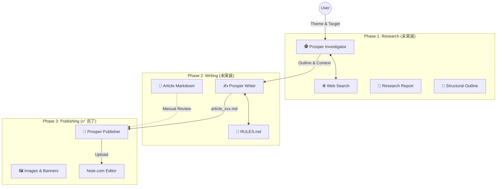

# 🌌 Project Prosper

**Automated Magazine-Quality Publishing System for Note.com**

Prosperは、Web上の情報調査から記事執筆、そしてNote.comへの美しいレイアウトでの投稿までを自動化する統合システムです。

---

## 🗺 System Architecture



---

## 🧩 Module Status & Definitions

### 1. 🕵️ Prosper Investigator (調査)
- **Status**: ⬜️ **TODO (未着手)**
- **Role**: 指定されたテーマについてWeb検索を行い、Note読者に刺さる「切り口」と「構成案」を作成する。
- **Input**: `テーマ` (例: "AIエージェントの未来"), `ターゲット読者`
- **Output**: 
  - `research.md`: 調査メモ・出典
  - `outline.md`: 記事構成案 (H1/H2/H3)

### 2. ✍️ Prosper Writer (執筆)
- **Status**: ⬜️ **TODO (未着手)**
- **Role**: 構成案に基づき、**`RULES.md`に完全準拠した**Markdown記事を執筆する。
- **Input**: `outline.md`, `research.md`
- **Output**: `article_001_xxx.md` (完成原稿)
- **Constraints**: 
  - H4禁止（太字を使用）
  - 適切なとこに画像プレースホルダーを配置

### 3. 🚀 Prosper Publisher (投稿)
- **Status**: ✅ **COMPLETE (V10)**
- **Role**: Markdown原稿を読み込み、Note.comのエディタを操作して完全なレイアウトで下書き保存する。
- **Engine**: `scripts/prosper_publisher.py`
- **Rules**: `RULES.md` (Note仕様定義書)
- **Features**:
  - H2/H3/リスト/区切り線の完全再現
  - **太字(`**`)の自動適用** (Script Hack)
  - バナー・本文画像の自動アップロード

---

## 📂 Directory Map
現状のディレクトリ構造と役割分担。

```
projects/prosper/
├── README.md                   # 👈 This File (全体地図)
├── RULES.md                    # ✅ 執筆・投稿の絶対ルール
├── scripts/
│   └── prosper_publisher.py    # ✅ 投稿エンジン本体
├── images/                     # 🖼 画像リソース
└── (Future Directories)
    ├── investigator/           # 🔜 調査モジュール予定地
    └── writer/                 # 🔜 執筆モジュール予定地
```
