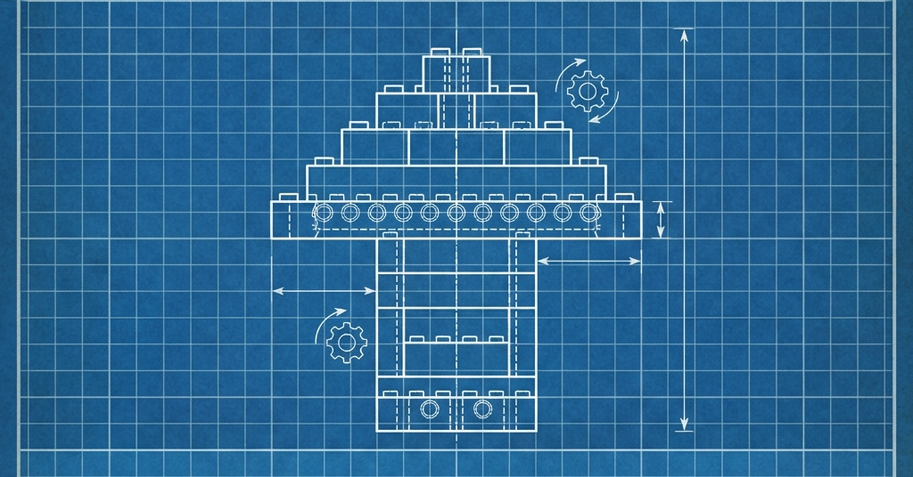

# S&P500よりLEGOを買え：年利11%の「プラスチック・ゴールド」投資論
## 2007年の5万円が60万円に化ける、最も確実で"手堅い"バブルの話

[BANNER]: ../assets/20260204_Lego_Banner_01.png

---

## 序章：金（ゴールド）よりも高いブロック
「もしタイムマシンがあったら、何を買う？」

Appleの株？ 初期のビットコイン？
もちろんそれも正解ですが、もっと**「夢」があり、かつ「再現性が高い」投資**がありました。
それは、かつておもちゃ屋の棚に無造作に並んでいた、ただのプラスチックの箱です。

### ロシア経済高等学院の衝撃的なレポート
「おもちゃ投資」などと笑ってはいられません。
2019年、ロシア国立研究大学経済高等学院（HSE）のVictoria Dobrynskaya教授とJulia Kishilova氏が発表した論文『The Toy of Smart Investors』が、金融業界に静かな衝撃を与えました。

彼らは **1987年から2015年の間に発売された2,322セットのレゴ** を対象に、その価格推移を徹底的に分析しました。
その結果導き出された数字は、驚くべきものでした。

**平均年利（ROI）11%**。

これは、同期間の **S&P 500（米国株式）や金（ゴールド）の実質リターンを上回っています。**
分析対象となったセットの中には、8年間で **2,230%（約22倍）** という、ベンチャー株のようなリターンを叩き出したものすら存在します。

さらに重要なのは、レゴの価格変動が **「景気動向と連動しない（Uncorrelated）」** という事実です。
2008年のリーマンショックで株式市場が暴落した際も、レゴの価値は下落するどころか、むしろ上昇し続けました。
そう、このカラフルなブロックは、不況下において金（Gold）と同じ働きをする **「安全資産」** だったのです。

---

## 第1章：伝説の証拠（The Monsters）
「平均11%」というのは、あくまで平均です。
市場の"王様"たちのパフォーマンスは、そんな生ぬるい数字ではありません。

### 王者：Millennium Falcon (Ultimate Collector Series) #10179
*   **発売年**: 2007年
*   **当時の定価**: $500（当時のレートで約5〜6万円）
*   **現在の取引価格**: **$4,000 〜 $7,000**（約60万〜100万円）
*   **リターン**: **約1,200% UP**

もし2007年に、飲み代を数回我慢してこの「銀河系最速のガラクタ」を1箱買い、押し入れに放り込んでおけば。
あなたは今頃、そのプラスチックの塊を売って、本物の中古車を買うことができました。

[IMAGE]: ../assets/20260204_Lego_Body_01.png

### 伏兵：Imperial AT-ST #10174
大型セットだけではありません。
*   **当時の定価**: 約10,000円
*   **現在の価格**: **約48,500円**（約5倍）

### タージ・マハル #10189
*   **発売**: 2008年
*   **当時の定価**: 約$300
*   **現在の価格**: **$3,000以上**（約10倍）

なぜこれほど上がるのか？
それは「懐かしさ」だけが理由ではありません。そこには、金融商品としてあまりに良くできた **「価格上昇のメカニズム」** が存在するのです。

---

## 第2章：錬金術のメカニズム（The Mechanism）
なぜプラスチックの塊が高騰するのか。
その仕組みは、ビットコインの半減期よりもシンプルで、そして残酷な **「供給の完全断絶」** にあります。

### 1. EOL（End Of Life）システム
レゴ製品の寿命は、驚くほど短いです。平均して **約2年**。
どんなに人気の商品でも、2年経てば生産ラインから消え、**廃盤（EOL: End Of Life）** になります。

そしてレゴ社は、原則として **「同じ金型での再生産」を行いません**。
リメイク版が出ることはありますが、それは「別物」として扱われ、オリジナルの価値が下がることは稀です。むしろ「初代」としての価値が際立ちます。

このサイクルが「確実な欠乏」を生みます。
1.  **現役期**: 誰でもAmazonで買える。
2.  **EOL確定**: 公式サイトから「Retired Product」のタグが付く。
3.  **供給停止**: 市場から新品在庫が消滅する。
4.  **需要爆発**: 「あの時買っておけば」というコレクターたちが、市場に残った未開封品を奪い合う。

### 2. "Once Opened, Value Drops"（開封の呪い）
この投資には、絶対的なルールがあります。
それは **「決して遊んではいけない」** ということです。

オークションサイトCatawikiの専門家Gerben van IJken氏によると、**「おもちゃは開封した瞬間に価値が25%以上下落する」** とされています。
投資対象としてのレゴは、ブロックそのものではありません。**「工場の空気が封印された箱（Sealed Box）」** なのです。

箱の角が潰れているだけでアウト。日焼けで色が褪せてもアウト。
投資家たちは、この「聖なる箱」を守るために、温度管理された暗室を用意し、まるで美術品のように扱います。
「おもちゃなのに遊べない」。この倒錯した状況こそが、狂気的なプレミア価値を支えているのです。

[IMAGE]: ../assets/20260204_Lego_Body_02.png

---

## 第3章：誰が儲けているのか？（The Players）
では、具体的にどれくらい儲かるものなのでしょうか？
市場には「お小遣い稼ぎ」から「プロ業者」まで、様々なプレイヤーが存在します。

### 副業レベル（Side Hustle）
*   **規模**: 月に5〜10セットを売却
*   **利益**: 1セットあたり3,000円〜5,000円
*   **年間収益**: **20万〜50万円**
これなら、普通のサラリーマンでも「趣味の延長」として可能です。

### 本業レベル（Pro Investor）
*   **規模**: 月に50〜100セットを販売
*   **利益**: 1セットあたり3,000円〜10,000円（大型セット中心）
*   **年間収益**: **300万〜800万円以上**

プロ層になると、もはや家のクローゼットでは足りません。
彼らは専用の倉庫を借り、BrickLinkやeBayといったグローバルなマーケットプレイスを駆使して、世界中の「AFOL（Adult Fan of LEGO）」に商品を供給しています。

---

## 第4章：リスクと「負けパターン」（The Trap）
「夢のような話だ。今すぐトイザらスに行こう」
そう思ったあなた、少し待ってください。データは「光」だけでなく「影」も映し出しています。

### 1. 保管コストと送料の罠
株券は電子データですが、レゴには「体積」があります。
ミレニアム・ファルコンの箱は、小型の冷蔵庫くらいのサイズがあります。「これ、どこに置くの？」という家族の冷ややかな視線は、最大の参入障壁です。
さらに、売却時の **送料** も無視できません。巨大な箱を海外へ発送するには、数千円〜数万円のコストがかかり、利益を圧迫します。

### 2. 「安物買い」の銭失い
「コストコで30%オフだったから」といって、不人気なセット（例：映画が大コケした『ローン・レンジャー』シリーズなど）を大量に買い込んでも、未来永劫上がりません。
需要がないものは、廃盤になっても需要がないままです。
初心者が陥りがちな「安値掴み」は、資金を数年間拘束されるだけの最悪の投資になります。

### 3. AFOLからの反感
一部の熱心なファン（AFOL）は、投資家や転売ヤーを「子供からおもちゃを奪う悪」として敵視しています。
市場の供給を独占して価格を吊り上げる行為は、コミュニティからの反発を招くリスクがあります。あくまで「市場に流動性を提供し、廃盤品を未来に残すアーカイブ活動」という倫理観が必要です。

---

## 第5章：勝利の法則（The Winning Strategy）
では、今から参入して勝つにはどうすればいいのか？
過去30年のデータが示す「勝ちやすいセット」の傾向は明確です。

### 1. "Big" or "Small"（中途半端は捨てろ）
ロシアの研究チームが発見した面白い傾向があります。
利回りが高いのは、**「超大型セット」** か **「小型セット」** のどちらかです。
*   **大型**: 生産数が少なく、富裕層コレクターがターゲット。
*   **小型**: 限定ミニフィグが含まれていることが多く、単価が安いため高騰倍率が出やすい。
一番ダメなのは、どこのスーパーでも売っている「中型セット」です。

### 2. 版権モノ（Licensed）は強い
スター・ウォーズ、ハリー・ポッター、スーパーヒーロー。
「映画のファン」は、レゴのファンよりも財布の紐が緩いです。特に「キャラクター（ミニフィグ）」の価値だけでセット代金の元が取れることも珍しくありません。

### 3. 「Ideas」と「Seasonal」
*   **LEGO Ideas**: ファン投稿から商品化されたシリーズ（『ゴッホ 星月夜』『ホーム・アローン』など）。生産期間が短く、コレクター心がくすぐられるため高騰しやすい。
*   **Seasonal**: クリスマスや旧正月限定のセット。「その時期しか買えない」という究極の限定性が武器になります。

---

## 結論：次のファルコンを探せ
現在、あなたの近くの家電量販店で「ワゴンセール」になっているレゴが、5年後にはお宝に変わっているかもしれません。

もちろん、投資に「絶対」はありません。
しかし、これだけは言えます。
もし値下がりして、投資として失敗しても、あなたには **「世界最高峰のブロック」** が手元に残ります。
最悪の場合、箱を開けて、子供（あるいは自分）と遊んでしまえばいいのです。

株券は紙くずになったら遊べませんが、レゴは遊べます。
これほどリスクヘッジが完璧な投資商品が、他にあるでしょうか？

